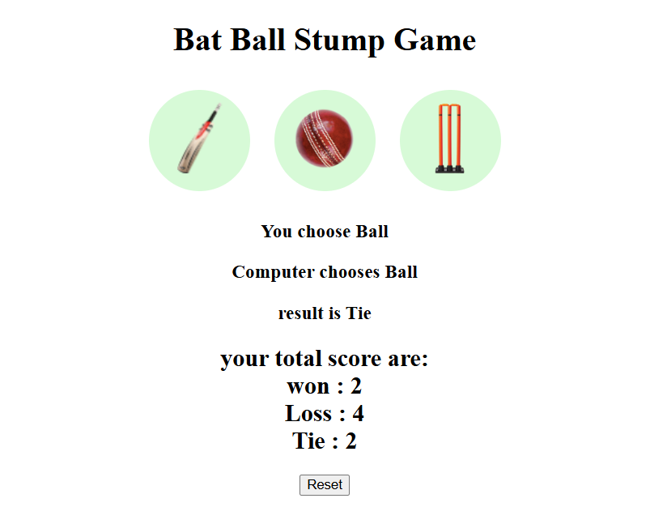

# 🏏 Bat Ball Stump Game

This is a fun **Bat Ball Stump Game** made with **HTML, CSS and JavaScript**.  
You can play against the computer and keep track of wins, losses, and ties.

---

## 🚀 Features
- Simple and fun gameplay  
- Score tracking system  
- Responsive design  
- Reset option  

---

## 📸 Screenshot

---

## 🎮 How to Play
1. Click on **Bat**, **Ball** or **Stump**.  
2. Computer will randomly choose one.  
3. Result (Win/Loss/Tie) and total score will be displayed.  
4. Use the **Reset** button to restart the score.  

---

## 🛠️ Tech Stack
- HTML  
- CSS  
- JavaScript  

---

## 🔗 Live Demo
👉 [Click here to play](https://anzararai.github.io/bat-ball-stump/)  

---

## 👨‍💻 Author
- **Anzar Arai**  
